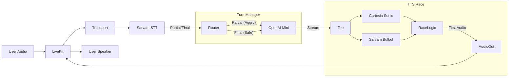

# Architecture

## Overview

The Hindi Voice Agent is a real-time, low-latency voice pipeline designed for sub-150ms turn-taking. It leverages a "Race" architecture for TTS to ensure the fastest possible audio delivery.

## Pipeline

## Components

### 1. LiveKit Transport (`agent/transport/livekit_transport.py`)
Handles WebRTC connections, receiving audio frames from the user, and sending back generated audio.

### 2. Services
- **STT**: Sarvam AI Saarika model via WebSocket. Supports partial results for low-latency interruption.
- **LLM**: OpenAI GPT-4o-mini with streaming enabled for immediate token generation.
- **TTS**:
    - **Cartesia**: Ultra-low latency streaming TTS.
    - **Sarvam**: Native Indian voice model.
    - **Racer**: Runs both providers in parallel, streams the winner, cancels the loser.

### 3. Turn Manager (`agent/core/turn_manager.py`)
Controls the flow based on `LATENCY_MODE`:
- **Aggro**: Speculative execution on partial STT results. Interrupts TTS on user speech.
- **Safe**: Waits for final STT results. No speculative execution.

### 4. Latency Tracker (`agent/core/latency_tracker.py`)
Instruments every step of the pipeline to ensure the <150ms target is met. Logs to CSV and console.

